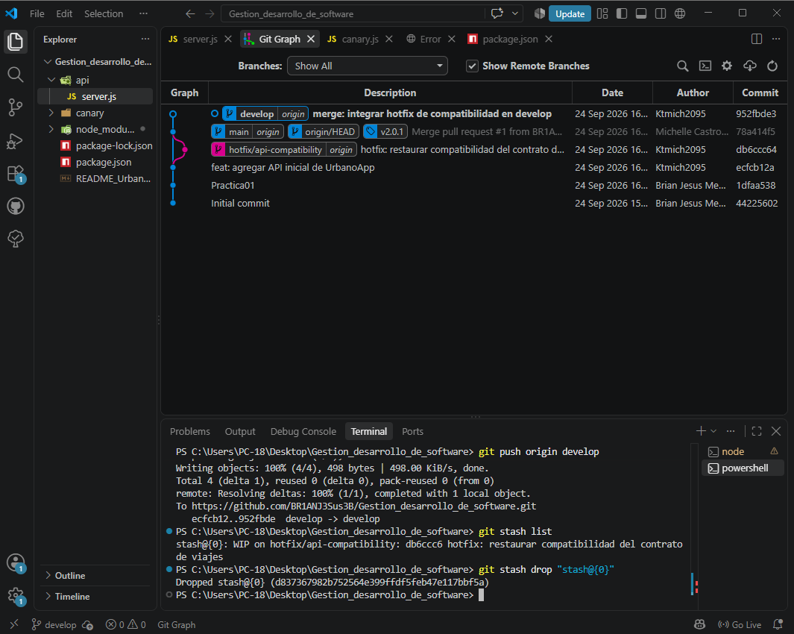
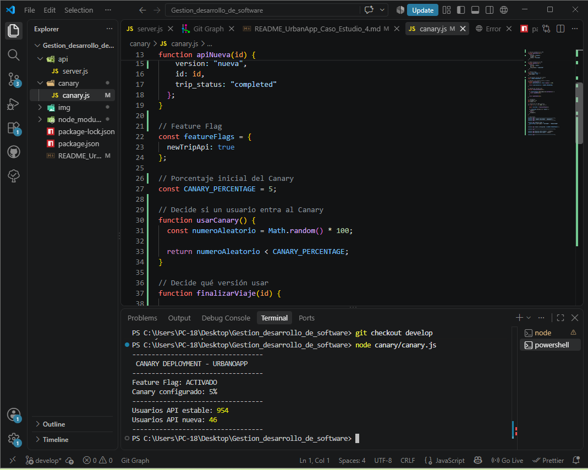
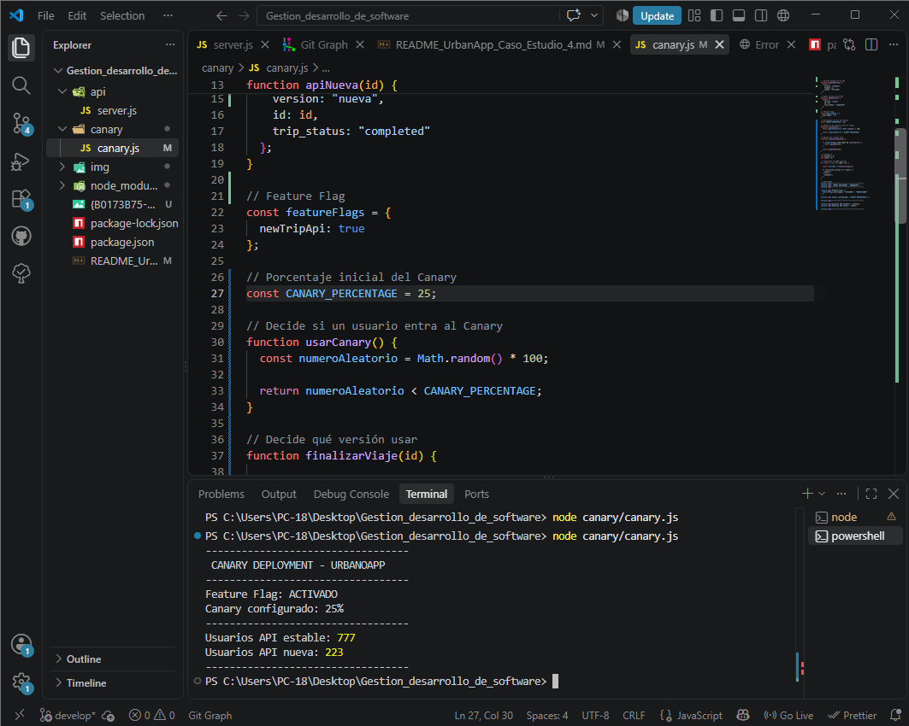
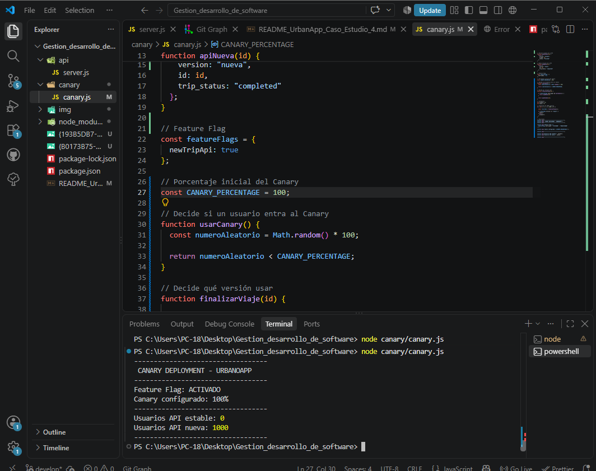
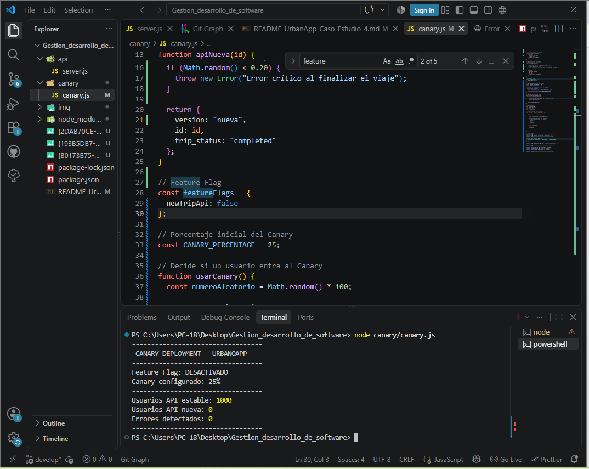

# Caso de Estudio 4 — App de Movilidad en Tiempo Real

## Empresa: UrbanoApp

### Contexto

UrbanoApp es una aplicación de geolocalización y viajes. Una actualización reciente de la API provocó incompatibilidad entre la aplicación móvil y el backend, impidiendo que algunos conductores finalizaran sus viajes.

Para solucionar el problema se implementaron dos estrategias:

1. **Gestión de Hotfixes con GitFlow**
2. **Canary Deployment con Feature Flags**

---

# 1. Gestión de Hotfixes con GitFlow

## Objetivo

Resolver un error crítico en producción sin detener el desarrollo de nuevas funcionalidades.

Se utilizó la siguiente estructura de ramas:

```text
main
develop
hotfix/api-compatibility
```

- `main`: versión estable.
- `develop`: desarrollo de nuevas funcionalidades.
- `hotfix/api-compatibility`: corrección urgente del problema.

---

## Problema

La API original regresaba:

```json
{
  "tripId": "123",
  "status": "finished"
}
```

Después de una actualización, el contrato cambió a:

```json
{
  "id": "123",
  "trip_status": "completed"
}
```

Esto generó incompatibilidad con versiones anteriores de la aplicación móvil.

---

## Creación del Hotfix

La rama se creó desde `main`:

```bash
git checkout main
git pull origin main
git checkout -b hotfix/api-compatibility
```

---

## Corrección

Se modificó la API para mantener ambos contratos temporalmente:

```javascript
app.post("/trips/:id/finish", (req, res) => {
  const id = req.params.id;

  res.json({
    tripId: id,
    status: "finished",
    id: id,
    trip_status: "completed"
  });
});
```

De esta manera se mantiene la **retrocompatibilidad**.

---

## Registro del Hotfix

```bash
git add .
git commit -m "hotfix: restaurar compatibilidad del contrato API"
git push -u origin hotfix/api-compatibility
```

Posteriormente se realizó un Pull Request hacia `main`.

También se creó la versión:

```bash
git tag -a v2.0.1 -m "Hotfix de compatibilidad de API"
git push origin v2.0.1
```

Finalmente, la corrección se integró también en `develop`:

```bash
git checkout develop
git merge main
git push origin develop
```

---

## Evidencia del Hotfix

En la siguiente imagen se observa:

- rama `main`
- rama `develop`
- rama `hotfix/api-compatibility`
- merge del Hotfix
- tag `v2.0.1`



---

# 2. Canary Deployment con Feature Flags

## Objetivo

Reducir el riesgo de una nueva versión liberándola gradualmente y permitiendo desactivar una funcionalidad rápidamente si presenta errores.

La estrategia utilizada fue:

```text
5% → 25% → 50% → 100%
```

El Canary Deployment permite que solo una parte de los usuarios utilice inicialmente la nueva versión. :contentReference[oaicite:2]{index=2}

---

## Feature Flag

Se utilizó un Feature Flag para habilitar o deshabilitar la nueva API:

```javascript
const featureFlags = {
  newTripApi: true
};
```

Cuando está activado:

```javascript
newTripApi: true
```

la nueva versión puede recibir tráfico.

Cuando se desactiva:

```javascript
newTripApi: false
```

todos los usuarios utilizan nuevamente la API estable.

---

## Canary 5%

Configuración:

```javascript
const CANARY_PERCENTAGE = 5;
```

Aproximadamente:

```text
95% → API estable
5%  → API nueva
```

### Evidencia



---

## Canary 25%

Se aumentó progresivamente el tráfico:

```javascript
const CANARY_PERCENTAGE = 25;
```

Aproximadamente:

```text
75% → API estable
25% → API nueva
```

### Evidencia



---

## Canary 100%

Después de comprobar el funcionamiento de la nueva versión:

```javascript
const CANARY_PERCENTAGE = 100;
```

Resultado:

```text
100% → API nueva
```

### Evidencia



---

## Desactivación del Feature Flag

Para simular un error en la nueva versión se desactivó:

```javascript
const featureFlags = {
  newTripApi: false
};
```

Resultado:

```text
API estable: 1000 usuarios
API nueva: 0 usuarios
Errores: 0
```

Esto demuestra que la funcionalidad puede apagarse rápidamente sin realizar un nuevo despliegue. Los Feature Flags se utilizan precisamente para activar o desactivar funcionalidades de esta forma. :contentReference[oaicite:3]{index=3}

### Evidencia



---

# Resultado

Con la práctica se logró:

- crear y aplicar un **Hotfix** desde `main`;
- mantener retrocompatibilidad en la API;
- integrar la corrección nuevamente en `develop`;
- crear la versión `v2.0.1`;
- simular un **Canary Deployment** progresivo;
- utilizar **Feature Flags** para regresar rápidamente a la versión estable.

La combinación de ambas estrategias permite reducir el impacto de errores y evitar que una actualización defectuosa afecte inmediatamente a todos los usuarios.